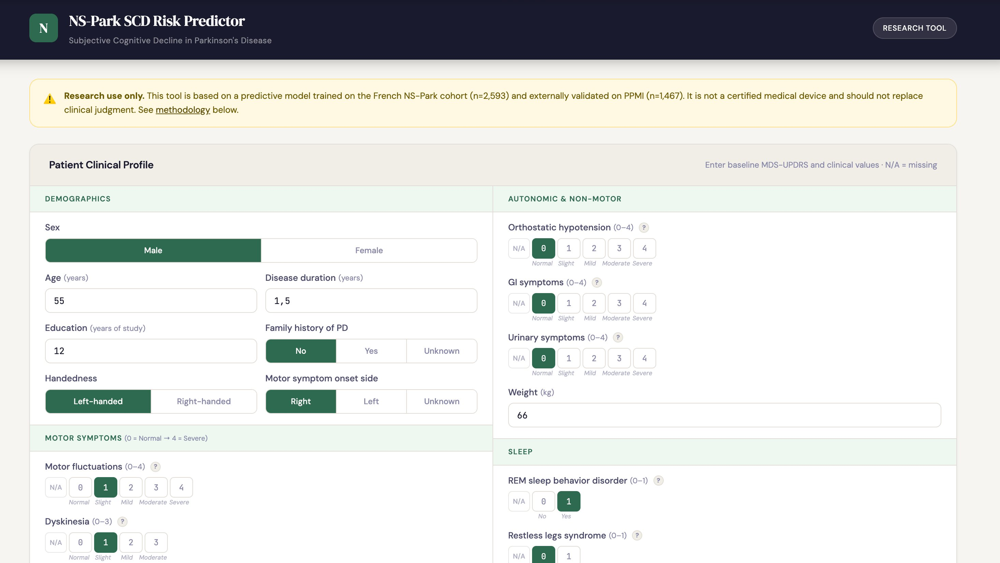
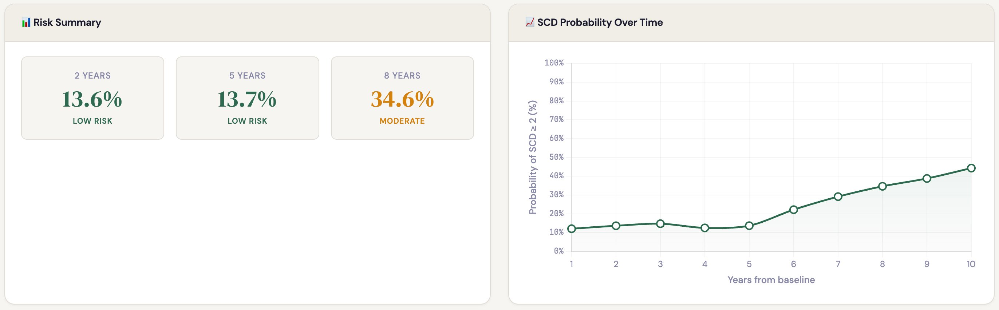

# NS-Park SCD Risk Predictor

A web-based clinical decision support tool for predicting **Subjective Cognitive Decline (SCD)** in Parkinson's Disease patients, based on routinely collected clinical data.

🔗 **[Live Demo](https://rlouiset.github.io/nspark-scd-predictor/)**

### Clinical Input Form


### Risk Prediction Results


## About

This tool implements the XGBoost classification model from:

> Louiset et al., "Risk stratification of future subjective cognitive decline in Parkinson's disease using large-scale real-world routine clinical data" (2026)

The model was trained on the **NS-Park French real-world cohort** (2,593 patients, 21,626 longitudinal segments) and externally validated on the **PPMI cohort** (1,467 patients).

### Performance
- **AUC 0.80** on NS-Park held-out test set
- **AUC 0.73** on external PPMI validation cohort
- Balanced accuracy: 0.73 (NS-Park), 0.70 (PPMI)

## Features

- **Probability Curve**: Predicts the probability of SCD ≥ 2 (MDS-UPDRS Part I.1) over 1–10 years from baseline
- **Risk Stratification**: Instant low/moderate/elevated risk classification at key time horizons
- **SHAP Interpretability**: Instance-wise feature contribution analysis showing which clinical features drive the prediction for each individual patient
- **Handles Missing Data**: The model natively handles missing values (NaN) — clinicians can leave unknown fields blank
- **Input Validation**: Required demographics check and completeness warnings for clinical features

## Input Features

The model uses 33 baseline clinical features (+ prediction horizon):

| Category | Features |
|----------|----------|
| Demographics | Sex, Age, Disease Duration, Education, Family History, Handedness |
| Motor | Motor Fluctuations, Dyskinesia, Pain, Dysarthria, Freezing, Falls, Postural Deformity, Swallowing |
| Autonomic | Orthostatic Hypotension, GI Symptoms, Urinary Symptoms, Weight |
| Sleep | REM Sleep Behavior Disorder, Restless Legs, Daytime Sleepiness |
| Neuropsychiatric | Apathy, Depression, Anxiety, Hallucinations/Psychosis, Impulse Control, L-DOPA Addiction, Punding |
| Staging | Cognitive Complaints (MDS-UPDRS I.1, baseline 0–1), Hoehn & Yahr ON/OFF, Total LEDD, Motor Symptom Onset Side |

## Deployment on GitHub Pages

1. Fork or clone this repository
2. Go to **Settings → Pages**
3. Set source to **Deploy from a branch** → `main` / `root`
4. Your tool will be live at `https://<username>.github.io/nspark-scd-predictor/`

The entire model runs **client-side in the browser** — no server or API needed. Patient data never leaves the clinician's device.

## Technical Details

- **Model**: XGBoost (500 trees, max_depth=15, learning_rate=0.01)
- **Model Size**: ~13 MB JSON (loads once, cached by browser)
- **SHAP**: Marginal intervention approximation (each feature is individually set to population median; the change in log-odds quantifies its contribution)
- **Privacy**: 100% client-side computation — no data is transmitted

## ⚠️ Disclaimer

This tool is for **research purposes only**. It is not a certified medical device and should not replace clinical judgment. Predictions reflect statistical associations learned from observational data, not individual diagnoses.

## Citation

```
@article{louiset2025nspark,
  title={Risk stratification of future subjective cognitive decline in Parkinson's disease using large-scale real-world routine clinical data},
  author={Louiset, Robin and Massart, Renaud and Cacciamani, Federica and others},
  year={2026}
}
```

## License

This research tool is provided for academic and clinical research use.
